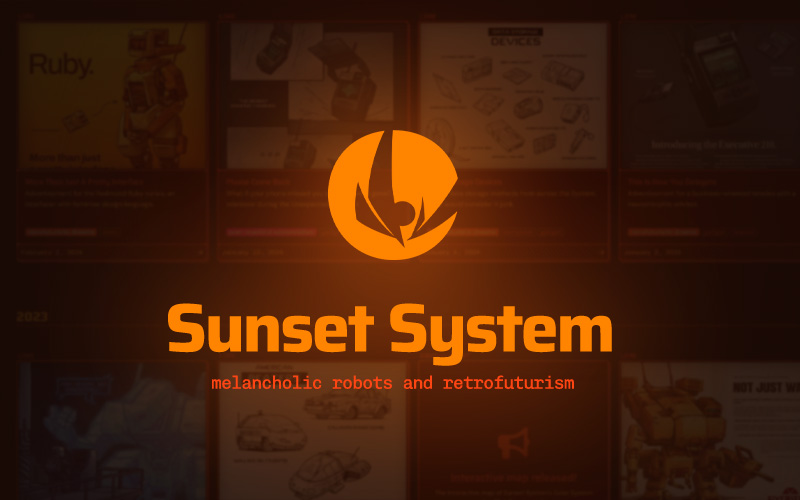

[](https://www.sunset-system.com)

**Sunset System** is an Astro-based custom worldbuilding blog. The website is currently automatically deployed and hosted on Vercel, at [sunset-system.com](https://www.sunset-system.com).

I developed, styled, and drew (almost) everything here. You may have seen my work on the internet before; drawing is a big hobby of mine. Nonetheless, I am a software engineer at heart.

# Technologies

*and why I chose them*

## Astro (web framework)

Astro is perfectly suited for static site generation, coming with markdown parsing (including MDX that lets you use React components directly), generation of dynamic routes, and image processing (good for compressing images to reduce payload, like generating tiny thumbnails for a posts list). Alternatives would include something like NextJS (if this had a back end this might have been a good option?), or straight up Vite (which Astro uses under the hood).

## React (front-end framework)

Muscle memory. Astro lets you use any framework, even Astro itself, for components. But React is what I know, and lets me easily make more advanced components... be sure to check out the map page, at [sunset-system.com/map](https://www.sunset-system.com/map).

## Typescript (programming language)

Enhanced JavaScript which adds static typing. No brainer ever since I switched to it. Transitioning from JS to TS has reduced the number of random type issues, especially about missing properties on objects, across both my personal and work projects.

## SCSS (styles)

Styles written in SCSS because it's super fast to do, it's embedded in my muscle memory. Nowadays I would start a project with either Tailwind or CSS modules.

## Jotai (state management)

Used to control state on the map specifically. Atomic because there really isn't much changing here, it's not a CRUD app nor is it too complex. Otherwise I would go with Zustand (big monolithic store) or React Query (lots of CRUD operations)

## Vercel (cloud hosting)

**Vercel** is a modern cloud hosting solution meant for NextJS.

Well, it also does Vite and Astro, has a nice deployment dashboard, and does all that for free (to a certain point), so it's my go to for any projects.

# Future considerations

I'm going to be adding whatever is necessary for the worldbuilding project. 

- Most pressing right now, **a section for fan creations** (as there have been a number of characters and pieces made by fans of the project.)
- **Comments section underneath blog posts**; this will have to be done by third party unless I shift to SSR or something, not sure.
- Considering waiting before developing anything major for this, as I'm working on a NextJS web app for creating and sharing worldbuilds, and this may be better served being on that platform eventually

# Running on local

To run the front end, just use

```
npm i
npm start
```

No back end here, so no database keys or anything like that to worry about.